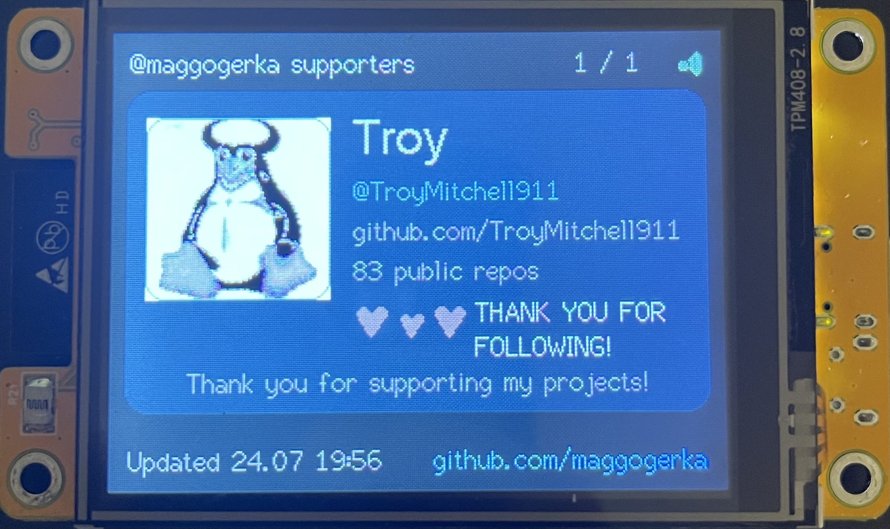
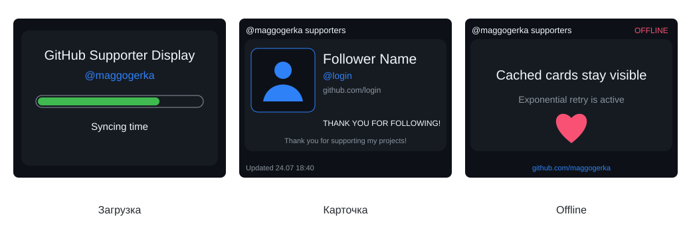
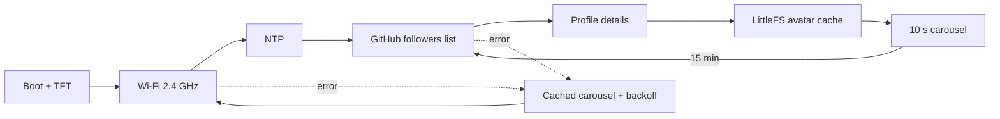

# GitHub Supporter Display

Настольный информер для классического **Cheap Yellow Display ESP32-2432S028R**. Устройство подключается к Wi‑Fi, получает публичный список подписчиков [@maggogerka](https://github.com/maggogerka) через GitHub REST API и непрерывно показывает карточки благодарности с аватарами.



> Версия v0.1.0 заменяет находящуюся на плате прошивку, включая Bruce. Вернуть Bruce можно обычной повторной прошивкой официального бинарника/веб‑инсталлятора Bruce.

## Как выглядит интерфейс



Статические подписи v0.1.0 используют понятный английский fallback: штатные bitmap-шрифты TFT_eSPI не содержат кириллицу, а шрифт с неясной лицензией намеренно не добавлялся. Имена профилей, которые нельзя корректно показать этим шрифтом, безопасно заменяют неподдерживаемые символы знаком `?`; `@login` всегда остаётся читаемым.

## Возможности v0.1.0

- полный первый лист публичных followers (до 100 профилей), а не только новые подписчики;
- подробные публичные данные: имя, login, bio, URL и число репозиториев;
- JPEG/PNG-аватары 96×96 (включая 16-bit PNG), HTTPS redirects, сигнатурная проверка и placeholder для GIF/ошибок;
- LittleFS-кэш аватаров и профилей: после перезапуска сохранённые карточки остаются доступны при потере сети или GitHub rate limit;
- неблокирующая 10-секундная карусель и обновление данных каждые 15 минут;
- проверка TLS через публичные root CA, NTP перед HTTPS;
- сохранение последней успешной карусели при потере сети и ограниченный exponential backoff;
- диагностика heap, сети, HTTP, JSON и файловой системы через Serial;
- unit-тесты чистой логики и сборка в GitHub Actions.

## Аппаратная платформа

Проект рассчитан на классический CYD с одним ESP32, дисплеем **2,8″ 320×240**, контроллером **ILI9341/ILI9341_2** и XPT2046. Touch в v0.1.0 не используется. Конфигурация сверена с [community-документацией ESP32-Cheap-Yellow-Display](https://github.com/witnessmenow/ESP32-Cheap-Yellow-Display) и её [локальным User_Setup](https://github.com/witnessmenow/ESP32-Cheap-Yellow-Display/blob/main/DisplayConfig/User_Setup.h).

| Сигнал | GPIO |
|---|---:|
| TFT MISO | 12 |
| TFT MOSI | 13 |
| TFT SCLK | 14 |
| TFT CS | 15 |
| TFT DC | 2 |
| TFT RST | -1 |
| TFT backlight | 21 |
| XPT2046 CS (не используется) | 33 |

TFT работает через HSPI на 40 МГц. Все настройки передаются в `platformio.ini`; редактировать глобальный `TFT_eSPI/User_Setup.h` не требуется.

## Схема работы



Загрузка details выполняется по одному профилю за проход state machine. HTTPS-запрос остаётся синхронным на время одного ответа, но десятисекундных `delay()` в карусели нет.

## Структура

```text
include/                 конфигурация, пример Wi-Fi, TLS trust anchors
lib/CoreLogic/           переносимая логика для firmware и host-тестов
src/app/                 state machine приложения
src/display/             экраны, декодирование и графические иконки
src/github/              REST API и модели
src/network/             Wi-Fi и NTP
src/storage/             LittleFS-кэш аватаров
src/utils/               retry/backoff
test/test_core_logic/    host-side unit-тесты
docs/                    макеты README
.github/workflows/       CI
```

## Зависимости

Версии закреплены в `platformio.ini`:

- Platform Espressif 32 `6.12.0` / Arduino-ESP32 `2.0.17`;
- TFT_eSPI `2.5.43`;
- ArduinoJson `7.4.2`;
- JPEGDEC `1.8.2`;
- локальная Apache-2.0 версия PNGdec `1.1.6` с поддержкой 16-bit samples;
- Unity `2.6.1` только для host-тестов.

## Установка и Wi‑Fi

1. Установите [VS Code](https://code.visualstudio.com/) и расширение [PlatformIO IDE](https://platformio.org/install/ide?install=vscode) либо PlatformIO CLI.
2. Скопируйте пример секретов:

   ```powershell
   Copy-Item include/secrets.example.h include/secrets.h
   ```

3. Измените только локальный `include/secrets.h`:

   ```cpp
   #pragma once
   constexpr char WIFI_SSID[] = "YOUR_WIFI_NAME";
   constexpr char WIFI_PASSWORD[] = "YOUR_WIFI_PASSWORD";
   ```

`include/secrets.h` игнорируется Git и дополнительно запрещён CI-проверкой. GitHub token проекту не нужен и добавлять его нельзя. Нужна сеть 2,4 ГГц; классический ESP32 не подключается к 5 ГГц.

Без `secrets.h` firmware всё равно собирается для CI, но на устройстве покажет понятную ошибку конфигурации и будет повторять подключение с backoff.

## COM-порт, сборка и прошивка

Подключите USB-разъём CYD с функцией data (у некоторых вариантов второй разъём предназначен только для питания). Найти порт:

```powershell
pio device list
Get-CimInstance Win32_SerialPort | Select-Object DeviceID, Name
```

Для подключённой при разработке платы указан `COM12`. Если Windows назначила другой порт, измените `upload_port` и `monitor_port` в `platformio.ini` или передайте порт в команде.

```powershell
# Сборка
pio run -e cyd

# Прошивка (полностью заменит Bruce)
pio run -e cyd -t upload --upload-port COM12

# Serial Monitor, 115200 baud
pio device monitor --port COM12 --baud 115200

# Host-тесты
pio test -e native
```

Если загрузка на 460800 нестабильна, временно установите `upload_speed = 115200`. При ошибке соединения удерживайте кнопку BOOT, запустите upload и отпустите BOOT после появления `Connecting...`.

## HTTPS и GitHub API

Запросы идут только к `https://api.github.com` и HTTPS URL аватаров. В firmware встроены публичные **Sectigo Public Server Authentication Root E46** и **ISRG Root X1**, актуальные для цепочек GitHub на июль 2026 года. Время сначала синхронизируется через NTP. `client.setInsecure()` в обычной сборке не используется.

Для лабораторной диагностики существует compile-time флаг `CYD_ALLOW_INSECURE_TLS`, но включать его в постоянной прошивке нельзя. Если GitHub сменит цепочку сертификатов, обновите `include/tls_certificates.h`, а не отключайте проверку.

Используется актуальный заголовок `X-GitHub-Api-Version: 2026-03-10`. Анонимный API ограничен примерно 60 запросами в час. Один refresh использует запрос списка и до одного details-запроса на follower. Если лимит закончился посередине, устройство сохраняет **весь** уже полученный список и показывает оставшиеся карточки по summary-данным; details дополнятся после следующего успешного refresh.

v0.1.0 получает первую страницу максимум из 100 followers. При ровно 100 ответах Serial явно сообщает о возможном ограничении; полноценная pagination запланирована на v0.2.0.

## Устранение неполадок

| Симптом | Что проверить |
|---|---|
| Белый/искажённый экран | плата должна быть ESP32-2432S028R с ILI9341; проверьте variant и питание |
| Экран тёмный | GPIO21, USB-питание и ориентацию платы |
| `Wi-Fi unavailable` | `secrets.h`, сеть 2,4 ГГц, пароль, уровень сигнала |
| NTP timeout / TLS error | доступ к UDP/123, DNS, корректность времени и актуальность root CA |
| HTTP 403/429 | дождитесь reset анонимного rate limit; быстрых повторов нет |
| Аватар-placeholder | формат GIF/неизвестный, redirect/TLS, >96 КБ или ошибка LittleFS |
| Upload не начинается | правильный COM, data-кабель, BOOT и скорость 115200 |
| Карусель осталась старой | это штатный offline fallback; причина видна в Serial |

## Проверка без нового подписчика

Новый follower не нужен: после каждого включения и каждые 15 минут загружается текущий публичный список. Для ускоренной лабораторной проверки временно уменьшите `kCarouselIntervalMs`/`kRefreshIntervalMs` в `include/app_config.h`, соберите firmware и затем верните значения 10 секунд/15 минут. Можно также отключить Wi‑Fi после успешной загрузки: карточки должны продолжить перелистываться с меткой `OFFLINE`.

## Физическая проверка

Программно проверяются компиляция, лимиты flash/RAM и чистая логика. На конкретной плате необходимо визуально подтвердить:

- правильные цвета/ориентацию ILI9341_2 и включение GPIO21;
- читаемость мелкого текста и отсутствие артефактов JPEG/PNG;
- реальное подключение к вашей точке Wi‑Fi, NTP и TLS;
- стабильность загрузки на 460800 и работу LittleFS после перезапуска;
- плавность десятисекундной карусели и восстановление после потери сети.

## Roadmap

- **v0.1.0:** Wi‑Fi из `secrets.h`, followers @maggogerka, details, аватары, LittleFS, карусель, refresh, offline/error и CI.
- **v0.2.0 (финальная):** настройка Wi‑Fi без перепрошивки, touch Next/Refresh, яркость, QR, улучшенные анимации, полный offline-список, pagination, ETag, статистика, OTA и корпус.

## Лицензия

[MIT](LICENSE) © 2026 Felix Bembiev.
